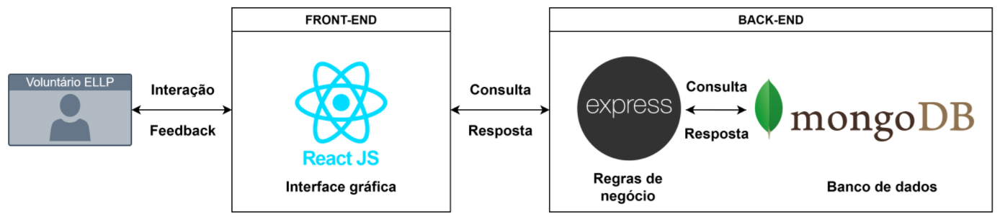

# Projeto - Oficina de Integração 2

## Descrição

Repositório destinado ao planejamento, desenvolvimento e documentação do sistema criado para o P.E Ensino Lúdico de Lógica de Programação (ELLP). O sistema visa facilitar o cadastro dos voluntários envolvidos no projeto, bem como gerenciar os certificados de participação atribuídos a cada um desses voluntários ao longo do programa.

Projeto avaliativo da disciplina Oficina de Integração II, do curso de Engenharia de Software da UTFPR.


## Tecnologias 

- 💻 Linguagem: JavaScript
- 🗄️ Banco de Dados: MongoDB
- ⚙️ Frameworks: React / Express
- 📦 Gerenciador de Pacotes: npm (Node.js)
- 🧪 Testes: Jest / Postman

## Requisitos Funcionais


| Código  | Funcionalidade                       | Descrição                                                                 |
|---------|--------------------------------------|---------------------------------------------------------------------------|
| RF1     | Autenticação de usuário              | O sistema deve permitir o login autenticado dos usuários para garantir o acesso às funcionalidades disponíveis.|
| RF2     | Cadastro dos voluntários             | O sistema deve permitir o cadastro dos voluntários.|
| RF3     | Gerenciamento dos voluntários        | O sistema deve permitir a alteração e exclusão dos dados dos voluntários, além de atualizar as informações relacionadas às oficinas em que participaram.|
| RF4     | Cadastro de voluntário com acesso ao sistema | O sistema deve permitir que usuários autorizados cadastrem outros voluntários|
| RF5     | Geração de termo de voluntariado     | O sistema deve permitir a geração automática do termo de voluntariado|
| RF6     | Gerenciamento dos certificados       | O sistema deve permitir o gerenciamento dos certificados dos voluntários, incluindo funcionalidades de alteração e exclusão quando necessário.|


## Arquitetura em Alto Nível
 


## Configuração do Ambiente

### Pré-requisitos
- Node.js
- MongoDB
- React
- npm

1. Clone o repositório:
```bash
git clone https://github.com/seu-usuario/oficina-de-integracao-II.git
cd oficina-de-integracao-II
```

2. Configure o backend:
```bash
cd backend
npm install
cp .env.example .env
# Configure as variáveis de ambiente no arquivo .env
```

3. Configure o frontend:
```bash
cd frontend
npm install
cp .env.example .env
```

## Testes de Backend
- Testes unitários com Jest
- Testes de integração com Supertest
- Cobertura mínima de 80% do código
- Mocking de dependências externas

## Cronograma - 2025

| Data            | Atividades                           |
| --------------- | -------------------------------- |
|  25/08 - 14/09  | Levantamento de requisitos & Definições Arquiteturais.
|  15/09 - 22/09  | Validação Planejamento
|  23/09 - 02/11  | SPRINT 1 - Desenvolvimento Back-end
|  03/11 - 10/11  | Validação SPRINT 1
|  12/11 - 07/12  | SRINT 2 - Desenvolvimento Front-end & Integração
|  08/12 - 15/12  | Validação SPRINT 2 & Sistema

## Integrantes

| Nome            | GitHub                           |
| --------------- | -------------------------------- |
| Daniel Jacob Jaroszczuk  | [@DanielJacob](https://github.com/Dani-Jacob)
| Felipe Aves Barea  | [@FelipeBarea](https://github.com/fehbarea)
